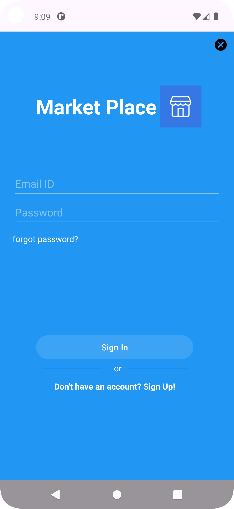
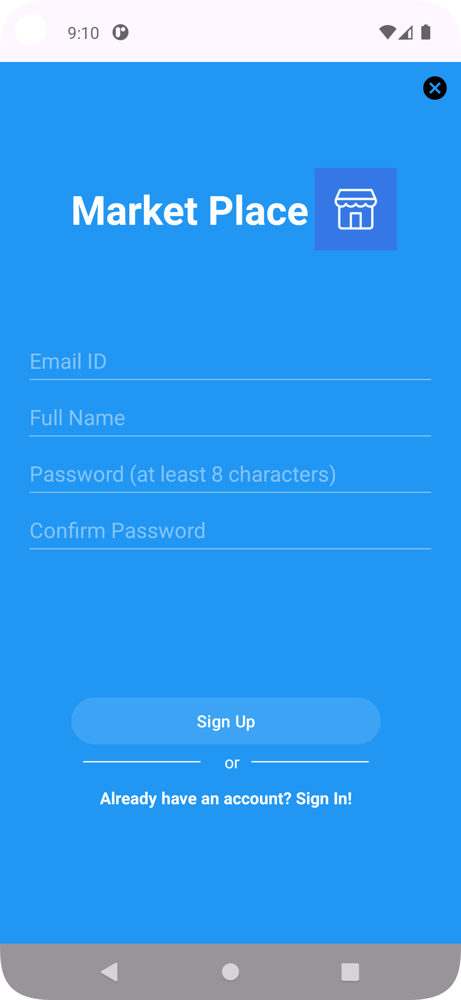
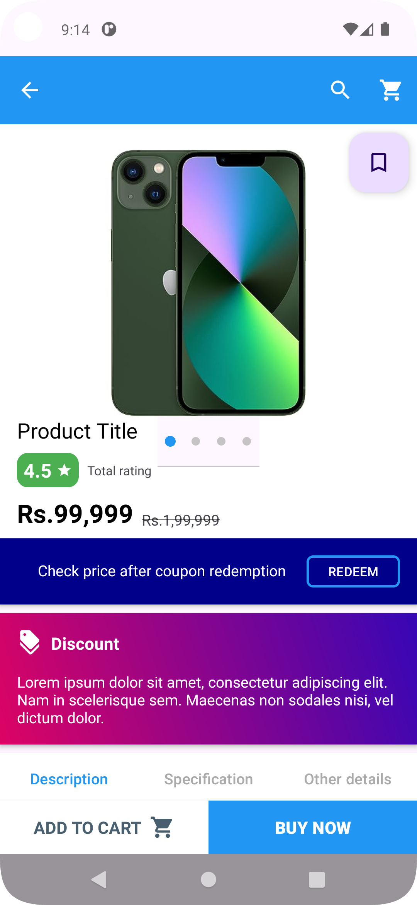
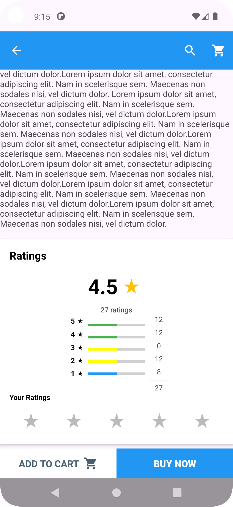
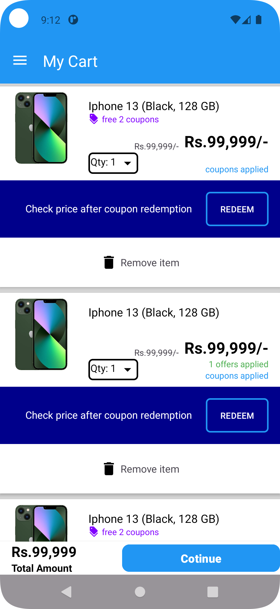

  

  <h1><strong>MarketPlace</strong></h1>

  
A modern Android marketplace app that connects buyers and sellers, built with Java and Firebase.

   

  
  
  

   
   

<h2>Features</h2>

<ul>
  <li><strong>User Authentication</strong>
    <ul>
      <li>Secure Firebase Authentication</li>
      <li>Email and Password login</li>
      <li>User profile management with profile pictures</li>
      <li>Password reset functionality</li>
    </ul>
  </li>
  
  <li><strong>Product Management</strong>
    <ul>
      <li>Easy product listing with images</li>
      <li>Multiple product categories</li>
      <li>Product search functionality</li>
      <li>Real-time product updates using Firebase</li>
    </ul>
  </li>
  
  <li><strong>Shopping Features</strong>
    <ul>
      <li>Intuitive shopping cart</li>
      <li>Favorites/Wishlist</li>
      <li>Product details view</li>
      <li>Category-wise browsing</li>
    </ul>
  </li>
  
  <li><strong>User Interface</strong>
    <ul>
      <li>Material Design components</li>
      <li>Smooth navigation using Navigation Component</li>
      <li>Responsive grid layouts</li>
      <li>Custom circular profile images</li>
      <li>Clean and modern UI</li>
    </ul>
  </li>
</ul>

<h2>Demo Video</h2>

  
<a href="https://github.com/user-attachments/assets/fbc1e14b-a422-4ee6-a9af-d614e19af3fa">Watch the demo video here</a>

<h2>Screenshots</h2>

<table>
  <tr>
    <td></td>
    <td></td>
    <td></td>
    <td></td>
  </tr>
  <tr>
    <td>Sign In</td>
    <td>Sign Up</td>
    <td>Home Screen</td>
    <td>My Account</td>
  </tr>
  <tr>
    <td></td>
    <td></td>
    <td></td>
    <td></td>
  </tr>
  <tr>
    <td>Product View</td>
    <td>Product Details</td>
    <td>Shopping Cart</td>
    <td>My Wishlist</td>
  </tr>
</table>

<h3>Additional Features:</h3>

<table>
  <tr>
    <td></td>
    <td></td>
    <td></td>
    <td></td>
  </tr>
  <tr>
    <td>My Orders</td>
    <td>Order Details</td>
    <td>My Rewards</td>
    <td>My Addresses</td>
  </tr>
</table>

<h2>Tech Stack</h2>

<ul>
  <li><strong>Language:</strong> Java</li>
  <li><strong>Platform:</strong> Android</li>
  <li><strong>Backend:</strong> Firebase
    <ul>
      <li>Firebase Authentication</li>
      <li>Cloud Firestore</li>
      <li>Firebase Analytics</li>
    </ul>
  </li>
  <li><strong>UI Components:</strong>
    <ul>
      <li>Material Design</li>
      <li>ConstraintLayout</li>
      <li>Navigation Component</li>
      <li>CircleImageView</li>
      <li>GridLayout</li>
    </ul>
  </li>
</ul>

<h2>Getting Started</h2>

<h3>Prerequisites</h3>

<ul>
  <li>Android Studio</li>
  <li>JDK 11 or higher</li>
  <li>Android SDK</li>
  <li>Google Play Services</li>
  <li>Firebase Account</li>
</ul>

<h3>Installation</h3>

<ol>
  <li>Clone the repository:
    <pre><code>git clone https://github.com/dilip2882/marketplace.git</code></pre>
  </li>
  <li>Open project in Android Studio</li>
  <li>Set up Firebase:
    <ul>
      <li>Create a new Firebase project</li>
      <li>Add your Android app to the Firebase project</li>
      <li>Download `google-services.json` and place it in the app directory</li>
      <li>Enable Authentication and Firestore in Firebase Console</li>
    </ul>
  </li>
  <li>Build and run the project</li>
</ol>

<h2>Architecture</h2>

The app follows the MVVM (Model-View-ViewModel) architecture pattern and uses:

<ul>
  <li>LiveData for observable data holders</li>
  <li>ViewModel for UI-related data handling</li>
  <li>Navigation Component for fragment navigation</li>
  <li>Firebase for backend services</li>
</ul>

<h2>Contributing</h2>

<ol>
  <li>Fork the repository</li>
  <li>Create your feature branch (`git checkout -b feature/AmazingFeature`)</li>
  <li>Commit your changes (`git commit -m 'Add some AmazingFeature'`)</li>
  <li>Push to the branch (`git push origin feature/AmazingFeature`)</li>
  <li>Open a Pull Request</li>
</ol>

<h2>License</h2>

  <pre>
  Copyright © 2015 Javier Tomás
  Copyright © 2024 Mihon Open Source Project

  Licensed under the Apache License, Version 2.0 (the "License");
  you may not use this file except in compliance with the License.
  You may obtain a copy of the License at

  http://www.apache.org/licenses/LICENSE-2.0

  Unless required by applicable law or agreed to in writing, software
  distributed under the License is distributed on an "AS IS" BASIS,
  WITHOUT WARRANTIES OR CONDITIONS OF ANY KIND, either express or implied.
  See the License for the specific language governing permissions and
  limitations under the License.
  </pre>

